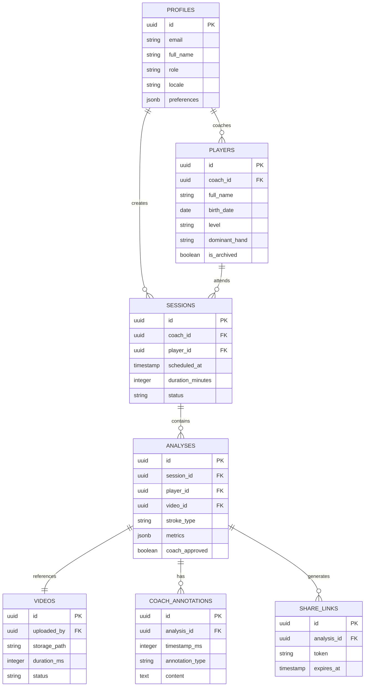

# Tennis Coach App - Step-by-Step Implementation Plan

A sequential implementation guide organized into **12 sprints**. Each step has clear deliverables and an **Owner Verification Checkpoint** that must be approved before proceeding.

---

## Implementation Order Rationale

**Backend-first approach** is used because:
1. Frontend needs real API endpoints to function properly
2. Database schema must exist before writing data-access code
3. Auth must be configured before building login screens
4. Avoids mock data that later needs replacement

---

## Entity Relationship Diagram



---

# Step 1: Project Setup & Configuration ✅
**Duration:** 2-3 days

## Tasks
1. Create Supabase project (production-ready from start)
2. Initialize React Native project with Expo
3. Configure environment variables (`.env.local`, `.env.production`)
4. Set up Git repository with branch protection
5. Install core dependencies:
   - `@supabase/supabase-js`
   - `expo-secure-store` (token storage)
   - `react-navigation`
   - `zustand` + `@tanstack/react-query`
   - `i18next` + `react-i18next`
   - `zod` + `react-hook-form`

## Deliverables
- [x] Supabase project created with URL and anon key
- [x] Expo app runs on iOS simulator and Android emulator
- [x] Environment switching works (dev vs prod)
- [x] Git repo with main/develop branches

## ✅ Owner Verification Checkpoint
| Check | Status |
|-------|--------|
| App launches on both platforms | ✅ |
| Supabase dashboard accessible | ✅ |
| Can switch environments | ✅ |

---

# Step 2: Database Schema & RLS ✅
**Duration:** 2-3 days

## Tasks
1. Create all tables via Supabase SQL editor:
   - `profiles` (extends auth.users)
   - `players`
   - `sessions`
   - `videos`
   - `analyses`
   - `coach_annotations`
   - `share_links`
2. Enable Row Level Security on all tables
3. Create RLS policies for coach role
4. Set up database triggers:
   - Auto-create profile on user signup
   - Update `updated_at` timestamps

## Database Schema

```sql
-- PROFILES (extends auth.users)
CREATE TABLE profiles (
  id uuid PRIMARY KEY REFERENCES auth.users(id) ON DELETE CASCADE,
  email text NOT NULL,
  full_name text,
  role text DEFAULT 'coach' CHECK (role IN ('coach', 'student', 'admin')),
  locale text DEFAULT 'en' CHECK (locale IN ('en', 'es')),
  preferences jsonb DEFAULT '{}',
  avatar_url text,
  created_at timestamptz DEFAULT now(),
  updated_at timestamptz DEFAULT now()
);

-- PLAYERS
CREATE TABLE players (
  id uuid PRIMARY KEY DEFAULT gen_random_uuid(),
  coach_id uuid NOT NULL REFERENCES profiles(id) ON DELETE CASCADE,
  full_name text NOT NULL,
  birth_date date,
  level text CHECK (level IN ('beginner', 'intermediate', 'advanced', 'professional')),
  dominant_hand text CHECK (dominant_hand IN ('left', 'right', 'ambidextrous')),
  contact_email text,
  contact_phone text,
  notes text,
  is_archived boolean DEFAULT false,
  created_at timestamptz DEFAULT now(),
  updated_at timestamptz DEFAULT now()
);

-- SESSIONS
CREATE TABLE sessions (
  id uuid PRIMARY KEY DEFAULT gen_random_uuid(),
  coach_id uuid NOT NULL REFERENCES profiles(id),
  player_id uuid REFERENCES players(id) ON DELETE SET NULL,
  scheduled_at timestamptz NOT NULL,
  duration_minutes integer DEFAULT 60,
  location text,
  session_type text CHECK (session_type IN ('individual', 'group', 'match')),
  status text DEFAULT 'scheduled' CHECK (status IN ('scheduled', 'completed', 'cancelled')),
  notes text,
  created_at timestamptz DEFAULT now(),
  updated_at timestamptz DEFAULT now()
);

-- VIDEOS
CREATE TABLE videos (
  id uuid PRIMARY KEY DEFAULT gen_random_uuid(),
  uploaded_by uuid NOT NULL REFERENCES profiles(id),
  storage_path text NOT NULL,
  original_filename text,
  duration_ms integer,
  file_size_bytes bigint,
  mime_type text,
  status text DEFAULT 'processing' CHECK (status IN ('processing', 'ready', 'error')),
  thumbnail_path text,
  metadata jsonb DEFAULT '{}',
  created_at timestamptz DEFAULT now()
);

-- ANALYSES
CREATE TABLE analyses (
  id uuid PRIMARY KEY DEFAULT gen_random_uuid(),
  session_id uuid REFERENCES sessions(id) ON DELETE SET NULL,
  player_id uuid NOT NULL REFERENCES players(id),
  video_id uuid NOT NULL REFERENCES videos(id) ON DELETE CASCADE,
  coach_id uuid NOT NULL REFERENCES profiles(id),
  stroke_type text NOT NULL CHECK (stroke_type IN ('forehand', 'backhand', 'serve', 'volley', 'smash', 'return', 'footwork')),
  pose_data jsonb,
  metrics jsonb NOT NULL,
  ai_feedback jsonb,
  coach_feedback text,
  coach_approved boolean DEFAULT false,
  approved_at timestamptz,
  created_at timestamptz DEFAULT now(),
  updated_at timestamptz DEFAULT now()
);

-- COACH ANNOTATIONS
CREATE TABLE coach_annotations (
  id uuid PRIMARY KEY DEFAULT gen_random_uuid(),
  analysis_id uuid NOT NULL REFERENCES analyses(id) ON DELETE CASCADE,
  coach_id uuid NOT NULL REFERENCES profiles(id),
  timestamp_ms integer NOT NULL,
  annotation_type text CHECK (annotation_type IN ('text', 'drawing', 'audio')),
  content text,
  drawing_data jsonb,
  position jsonb,
  created_at timestamptz DEFAULT now()
);

-- SHARE LINKS
CREATE TABLE share_links (
  id uuid PRIMARY KEY DEFAULT gen_random_uuid(),
  analysis_id uuid NOT NULL REFERENCES analyses(id) ON DELETE CASCADE,
  created_by uuid NOT NULL REFERENCES profiles(id),
  token text UNIQUE NOT NULL DEFAULT encode(gen_random_bytes(32), 'hex'),
  expires_at timestamptz NOT NULL,
  is_active boolean DEFAULT true,
  view_count integer DEFAULT 0,
  max_views integer,
  created_at timestamptz DEFAULT now()
);
```

## RLS Policies

```sql
-- Enable RLS
ALTER TABLE profiles ENABLE ROW LEVEL SECURITY;
ALTER TABLE players ENABLE ROW LEVEL SECURITY;
ALTER TABLE sessions ENABLE ROW LEVEL SECURITY;
ALTER TABLE videos ENABLE ROW LEVEL SECURITY;
ALTER TABLE analyses ENABLE ROW LEVEL SECURITY;
ALTER TABLE coach_annotations ENABLE ROW LEVEL SECURITY;
ALTER TABLE share_links ENABLE ROW LEVEL SECURITY;

-- Profiles
CREATE POLICY "Users view own profile" ON profiles FOR SELECT USING (auth.uid() = id);
CREATE POLICY "Users update own profile" ON profiles FOR UPDATE USING (auth.uid() = id);

-- Players
CREATE POLICY "Coaches manage own players" ON players FOR ALL USING (coach_id = auth.uid());

-- Sessions
CREATE POLICY "Coaches manage own sessions" ON sessions FOR ALL USING (coach_id = auth.uid());

-- Videos
CREATE POLICY "Coaches manage own videos" ON videos FOR ALL USING (uploaded_by = auth.uid());

-- Analyses
CREATE POLICY "Coaches manage own analyses" ON analyses FOR ALL USING (coach_id = auth.uid());

-- Coach Annotations
CREATE POLICY "Coaches manage own annotations" ON coach_annotations FOR ALL USING (coach_id = auth.uid());

-- Share Links
CREATE POLICY "Coaches manage own share links" ON share_links FOR ALL 
  USING (EXISTS (SELECT 1 FROM analyses WHERE analyses.id = share_links.analysis_id AND analyses.coach_id = auth.uid()));
```

## Deliverables
- [x] All 7 tables created with correct columns
- [x] RLS enabled and policies applied
- [x] Profile auto-creation trigger working

## ✅ Owner Verification Checkpoint
| Check | Status |
|-------|--------|
| Tables visible in Supabase dashboard | ✅ |
| Test user signup creates profile | ✅ |
| RLS blocks cross-user data access | ✅ |

---

# Step 3: Storage Buckets & Edge Functions ✅
**Duration:** 2-3 days

## Tasks
1. Create storage buckets:
   - `videos` (private)
   - `analysis-artifacts` (private)
   - `avatars` (public read)
2. Configure storage RLS policies
3. Deploy Edge Functions:
   - `process-video`: compress + thumbnail
   - `generate-share-link`: create secure token
   - `validate-share-link`: verify access
   - `cleanup-expired`: daily cron

## Storage Structure
```
videos/{coach_id}/originals/{video_id}.mp4
videos/{coach_id}/processed/{video_id}/compressed.mp4
videos/{coach_id}/processed/{video_id}/thumbnail.jpg
analysis-artifacts/{analysis_id}/keyframes/
avatars/{user_id}.jpg
```

## Deliverables
- [x] 3 storage buckets created
- [x] Storage policies block unauthorized access
- [x] Edge Functions deployed and callable

## ✅ Owner Verification Checkpoint
| Check | Status |
|-------|--------|
| Can upload file to videos bucket | ✅ |
| Cannot access other user's files | ✅ |
| Edge Functions respond (test via curl) | ✅ |

---

# Step 4: Authentication Flow ✅
**Duration:** 3-4 days

## Tasks
1. Configure Supabase Auth providers:
   - Email/password
   - Google OAuth
   - Apple Sign-In
2. Build auth screens:
   - Login screen
   - Register screen
   - Forgot password screen
3. Implement auth hooks:
   - `useAuth()` — session state
   - `useProfile()` — user profile
4. Set up secure token storage with `expo-secure-store`
5. Handle deep links for OAuth callbacks

## Deliverables
- [x] Login/register/forgot-password screens complete
- [x] Google and Apple OAuth working
- [x] Session persists across app restarts
- [x] Logout clears all tokens

## ✅ Owner Verification Checkpoint
| Check | Status |
|-------|--------|
| Email signup with confirmation | ✅ |
| Google Sign-In works | ✅ |
| Apple Sign-In works | ⬜ |
| Password reset email received | ✅ |
| App remembers login after close | ✅ |

---

# Step 5: Navigation & App Shell ✅
**Duration:** 2-3 days

## Tasks
1. Set up React Navigation:
   - Auth stack (unauthenticated)
   - Main tabs (authenticated)
   - Nested stacks per tab
2. Build tab bar with icons:
   - Home (Dashboard)
   - Players
   - Calendar
   - Analysis
   - Profile
3. Implement navigation guards (redirect if not logged in)
4. Set up i18n with language switcher

## Navigation Structure
```
Root
├── AuthStack (if not logged in)
│   ├── Login
│   ├── Register
│   └── ForgotPassword
└── MainTabs (if logged in)
    ├── HomeStack → Dashboard
    ├── PlayersStack → List → Detail → Form
    ├── CalendarStack → Month → Week → Day → SessionDetail
    ├── AnalysisStack → List → Capture → Processing → Results → Review → Share
    └── ProfileStack → Settings → Language
```

## Deliverables
- [x] Tab navigation working on both platforms
- [x] Auth guard redirects properly
- [x] i18n toggles between English/Spanish
- [x] All placeholder screens navigable

## ✅ Owner Verification Checkpoint
| Check | Status |
|-------|--------|
| Can navigate all tabs | ✅ |
| Logout returns to login | ✅ |
| Language switch updates all text | ✅ |

---

# Step 6: Players Module (CRUD) 🚀 NEXT
**Duration:** 3-4 days

## Tasks
1. Build screens:
   - Player list with search
   - Player detail view
   - Add/edit player form
2. Implement data hooks:
   - `usePlayers()` — list with search
   - `usePlayer(id)` — single player
   - `usePlayerMutations()` — create/update/archive
3. Form validation with Zod schema
4. Archive functionality (soft delete)
5. Pull-to-refresh and loading states

## Deliverables
- [ ] Create new player with all fields
- [ ] View player list with search
- [ ] Edit existing player
- [ ] Archive player (not hard delete)
- [ ] Data persists in Supabase

## ✅ Owner Verification Checkpoint
| Check | Status |
|-------|--------|
| Create player appears in list | ⬜ |
| Edit player saves changes | ⬜ |
| Archive hides from list | ⬜ |
| Search filters correctly | ⬜ |
| Data visible in Supabase dashboard | ⬜ |

---

# Step 7: Calendar & Sessions Module ✅
**Duration:** 4-5 days

## Tasks
1. Build calendar views:
   - Month view with session dots
   - Week view with time slots
   - Day view with agenda
2. Build session management:
   - Session detail screen
   - Add/edit session form
   - Link session to player
3. Implement data hooks:
   - `useSessions(dateRange)` — filtered by date
   - `useSession(id)` — single session
   - `useSessionMutations()` — create/update/cancel
4. Session status management (scheduled → completed/cancelled)

## Deliverables
- [ ] Month/week/day calendar views
- [ ] Create session with player, date, time, location
- [ ] Edit and cancel sessions
- [ ] Sessions appear as dots on calendar

## ✅ Owner Verification Checkpoint
| Check | Status |
|-------|--------|
| Create session shows on calendar | ⬜ |
| Tap date → see day's sessions | ⬜ |
| Edit session updates calendar | ⬜ |
| Cancel session updates status | ⬜ |

---

# Step 8: Video Capture & Upload
**Duration:** 4-5 days

## Tasks
1. Build video capture screen:
   - Camera preview with flip button
   - Record button with timer
   - Video preview after recording
2. Build video upload:
   - Pick from gallery
   - Upload progress indicator
   - Handle upload failures
3. Implement hooks:
   - `useVideoCapture()` — camera control
   - `useVideoUpload()` — upload to Storage
4. Trigger `process-video` Edge Function after upload

## Deliverables
- [ ] Record video from camera (10-60 seconds)
- [ ] Preview before confirming
- [ ] Upload from gallery
- [ ] Progress bar during upload
- [ ] Thumbnail generated automatically

## ✅ Owner Verification Checkpoint
| Check | Status |
|-------|--------|
| Record video works on iOS | ⬜ |
| Record video works on Android | ⬜ |
| Gallery picker works | ⬜ |
| Video appears in Supabase Storage | ⬜ |
| Thumbnail generated | ⬜ |

---

# Step 9: MediaPipe Analysis (Forehand)
**Duration:** 5-6 days

## Tasks
1. Integrate `react-native-mediapipe` for pose detection
2. Build analysis processing screen:
   - Frame-by-frame pose extraction
   - Progress indicator
   - Cancel option
3. Implement forehand analyzer:
   - Detect stroke phases (preparation → contact → follow-through)
   - Calculate metrics (shoulder rotation, elbow angle, knee bend)
   - Generate AI feedback based on thresholds
4. Store analysis results in Supabase

## Forehand Metrics
| Metric | Measurement | Ideal Range | Feedback |
|--------|-------------|-------------|----------|
| Preparation | Shoulder rotation | 45-90° | "Good shoulder turn" / "Increase backswing" |
| Contact Point | Elbow angle | 140-170° | "Arm extended well" / "Contact too close" |
| Follow-through | Wrist position | Above shoulder | "Full finish" / "Finish higher" |
| Stance | Knee bend | 130-160° | "Good stance" / "Bend knees more" |

## Deliverables
- [ ] MediaPipe runs on-device
- [ ] Pose overlay visible during processing
- [ ] Metrics calculated for forehand
- [ ] AI feedback generated
- [ ] Results saved to database

## ✅ Owner Verification Checkpoint
| Check | Status |
|-------|--------|
| Pose skeleton overlays on video | ⬜ |
| Analysis completes in <30 seconds | ⬜ |
| Metrics displayed are reasonable | ⬜ |
| Feedback in correct language | ⬜ |
| Analysis record in Supabase | ⬜ |

---

# Step 10: Coach Review & Annotations
**Duration:** 4-5 days

## Tasks
1. Build analysis results screen:
   - Video player with pose overlay
   - Metrics panel with scores
   - AI feedback list
2. Build coach review screen:
   - Editable text annotations per timestamp
   - Coach feedback text area
   - "Approve" button
3. Implement annotation hooks:
   - `useAnnotations(analysisId)`
   - `useAnnotationMutations()`
4. Track coach approval state

## Deliverables
- [ ] View analysis with metrics and feedback
- [ ] Add text annotations at video timestamps
- [ ] Edit/delete annotations
- [ ] Write overall coach feedback
- [ ] Mark analysis as "coach approved"

## ✅ Owner Verification Checkpoint
| Check | Status |
|-------|--------|
| Metrics display correctly | ⬜ |
| Can add annotation at timestamp | ⬜ |
| Approve button sets flag | ⬜ |
| Coach feedback saves | ⬜ |

---

# Step 11: Secure Sharing
**Duration:** 3-4 days

## Tasks
1. Build share flow:
   - Generate share link via Edge Function
   - Set expiration (default 7 days)
   - Copy link or open share sheet
2. Build public share viewer:
   - Validate token via Edge Function
   - Display video + metrics + feedback
   - Increment view count
3. Handle expired/invalid links gracefully

## Deliverables
- [ ] Generate share link from analysis
- [ ] Share via native share sheet
- [ ] Recipient can view without account
- [ ] Link expires after set period
- [ ] Invalid link shows error page

## ✅ Owner Verification Checkpoint
| Check | Status |
|-------|--------|
| Share link generated | ⬜ |
| Open link in browser shows analysis | ⬜ |
| Link stops working after expiration | ⬜ |
| View count increments | ⬜ |

---

# Step 12: Polish & Launch Prep
**Duration:** 4-5 days

## Tasks
1. Offline support:
   - Cache players and sessions locally
   - Queue mutations when offline
   - Sync on reconnect
2. Error handling:
   - Global error boundary
   - User-friendly error messages
   - Retry mechanisms
3. Performance:
   - Optimize list rendering
   - Lazy load screens
   - Compress images
4. Testing:
   - Unit tests for analyzers
   - E2E tests for critical flows
5. App store preparation:
   - App icons and splash screen
   - Screenshots for store listing
   - Privacy policy URL

## Deliverables
- [ ] App works offline for basic viewing
- [ ] Errors show user-friendly messages
- [ ] Cold start under 3 seconds
- [ ] All critical paths tested
- [ ] App store assets ready

## ✅ Owner Verification Checkpoint
| Check | Status |
|-------|--------|
| Airplane mode: can view players | ⬜ |
| No crashes during normal use | ⬜ |
| App icons display correctly | ⬜ |
| All E2E tests pass | ⬜ |

---

# Summary Timeline

| Step | Name | Duration | Cumulative |
|------|------|----------|------------|
| 1 | Project Setup | 2-3 days | Week 1 |
| 2 | Database Schema & RLS | 2-3 days | Week 1 |
| 3 | Storage & Edge Functions | 2-3 days | Week 2 |
| 4 | Authentication | 3-4 days | Week 2-3 |
| 5 | Navigation & Shell | 2-3 days | Week 3 |
| 6 | Players Module | 3-4 days | Week 4 |
| 7 | Calendar & Sessions | 4-5 days | Week 5 |
| 8 | Video Capture & Upload | 4-5 days | Week 6 |
| 9 | MediaPipe Analysis | 5-6 days | Week 7-8 |
| 10 | Coach Review | 4-5 days | Week 9 |
| 11 | Secure Sharing | 3-4 days | Week 10 |
| 12 | Polish & Launch | 4-5 days | Week 11-12 |

**Total: ~12 weeks** to production-ready MVP

---

# Technology Stack (Final)

| Layer | Technology |
|-------|------------|
| **Mobile Framework** | React Native + Expo (managed) |
| **Navigation** | React Navigation 6 |
| **State Management** | Zustand + React Query |
| **Forms** | React Hook Form + Zod |
| **Internationalization** | i18next |
| **Backend** | Supabase (Auth, Postgres, Storage, Edge Functions) |
| **Video Analysis** | MediaPipe Pose (on-device) |
| **Camera** | expo-camera + expo-av |

---

# Future Extensions (Not in MVP)

After launch, these features can be added:

1. **Student Access** — Add student role, invitation flow, read-only dashboard
2. **Additional Strokes** — Backhand, serve, volley, smash, return, footwork analyzers
3. **Push Notifications** — Session reminders, share notifications
4. **Drawing Annotations** — Draw on video frames
5. **Progress Tracking** — Charts showing improvement over time
